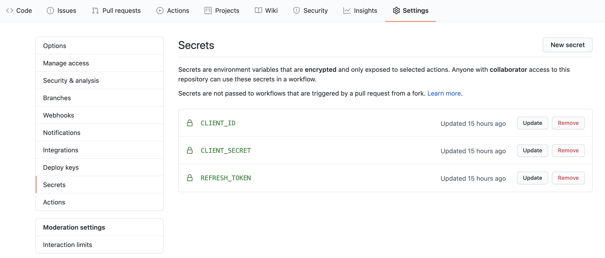

# Savetify

Quick script to download user saved tracks from Spotify with a scheduled Github Action workflow

## Setup Spotify credentials

You will have to get a `CLIENT_ID` and `CLIENT_SECRET` from Spotify and also a `REFRESH_TOKEN` to be able to request data from your user account.

You will find full instructions through https://developer.spotify.com/documentation/web-api/quick-start/.

Once you have the credentials you can add them in `Settings/Secrets` to allow access from Github Action.

